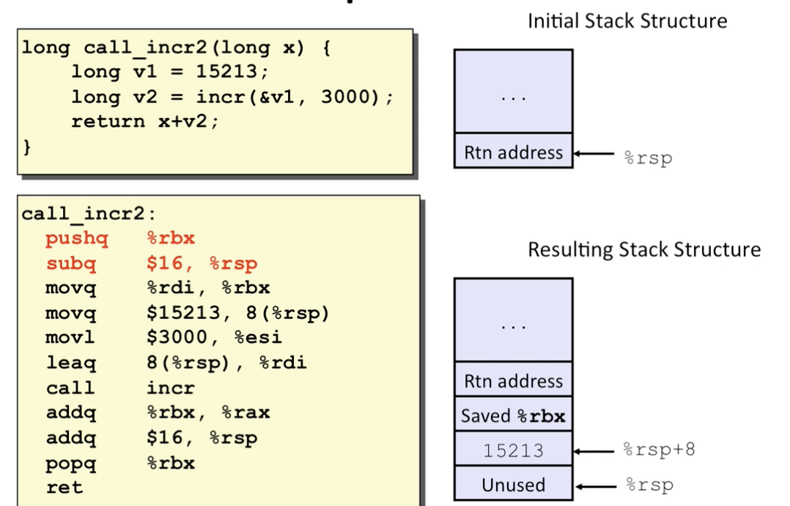
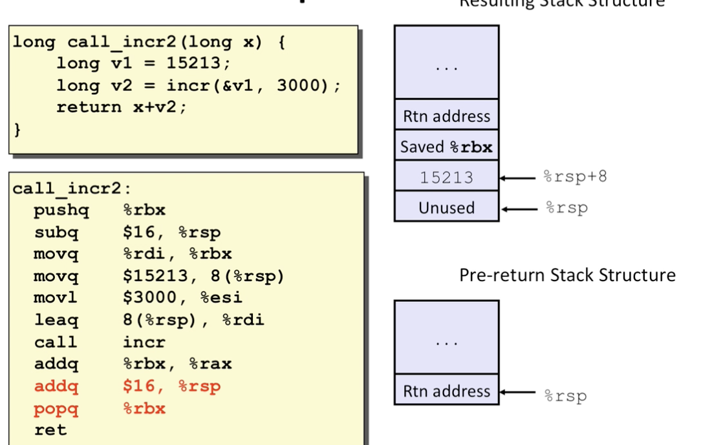
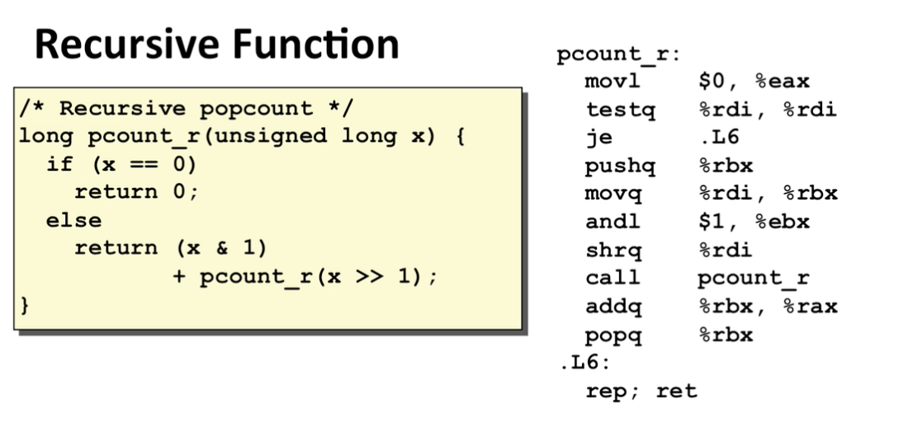
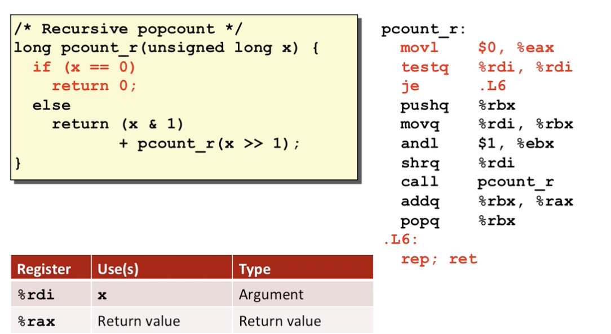
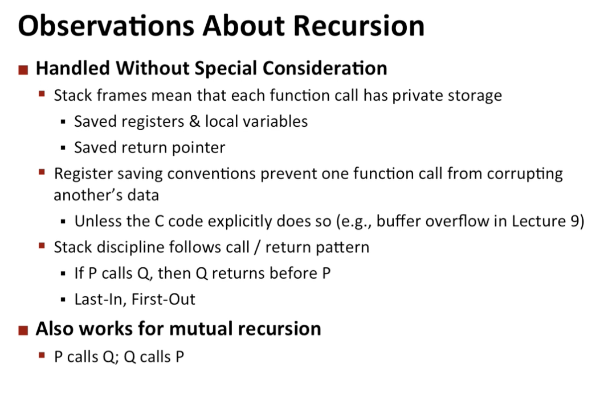
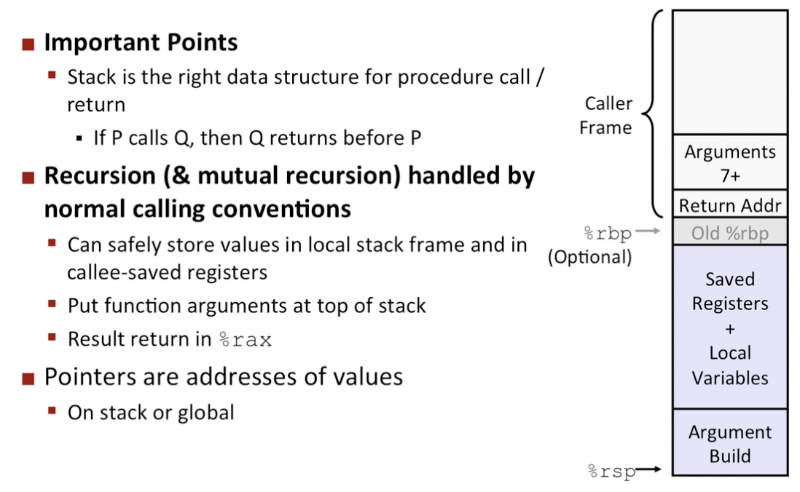

# Intro
- ABI : interface of machine level programming 
- Machanics in procedures 
    - passing ctrls 
        - know how to start proced call 
        - know how to return it 
    - passing data 
        - procedure args 
        - return val
    - memory management
        - allocation during the procedure call 
        - deallocate upon return 
    - machine all implenent with machine instrs 

# Stack structure 

- adding an element = decrease the stack pointer 

## push 

- pushq SRC 
    - Fetch operand at SRC
    - decrease %rsp by 8
    - write operand at address given by %rsp 

- popq DST 
    - read val at addr given by rsp 
    - increase %rsp by 8
    - store value at dest(must be register)

# Calling convensions 

Examples: 

## Procedure control flow 
- use stack to support procedure call and return 
- procedure call: call, label
    - push return address to stack 
    - jump to label 
- return address 
    - address of the next instr right after the call 
    - example from disassembly
- procedure return : ret 
    - pop addr from stack 
    - jump to addr 

Example: we assume the stack top part is at 0x120, 

- increase the stack pointer
- write the addr of the following instruction (going to return )
- change the dest addr to rip 

- after ret instr is hit
- assume the top of stack has an address 
- pop that addr
- jump to the addr

## Passing data 

According to ABI: 

- for ints and pointers 

Example: 

## Managing local data

stack based languages 
- languages that supports recursion 
    - code must be reentrant((of an angle) pointing inward)
        - multiple simultaneous instantiations of single procedure
    - need some space to store data of each one 
        - args 
        - local vars 
        - return ptr
- stack descipline 
    - state for given procedure need for limited time 
        - from when called to when return 
    - callee returns before caller does 
- stacks allocated in frames
    - state for single procedure instantiation

example: 

stack frames 

- contents 
    - return info 
    - local stoarge (if needed )
    - temp space (if needed )
- mamagement 
    - space allocated when enter procedure 
        - set-up mode 
        - includes push by call instr 
    - deallocated when return 
        - finish code 
        - includes pop by ret instr 

Example: 

- each one has its local state 

stack frames looks like: 

Example: 

- red one allocs states 

- movl stores the 2nd instr of the call 
- lea is used to create pointers 
    - copy the computed address to rdi

then call instr 

register saving convensions 
- may be overwritten 

x86-64 register usage 

Example; 

# Recursion example 

## Observations about recursion 

# Summary 

    